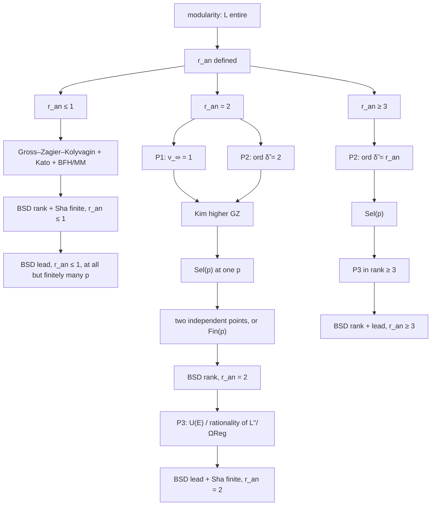

# Proof architecture — BSD over \(\mathbb{Q}\)

Status: coordinator synthesis after Wave 2 agent failure (Fable 5.1 quota exhausted, 2026-09-11).
Tags follow `../00-charter.md`. Implications below are either `[THEOREM]` (cited) or `[NEW]` reductions already proved in `../03-obstructions-rank-ge-2.md`.

---

## 0. The target

Let \(E/\mathbb{Q}\) be an elliptic curve.

- **BSD(rank):** \(r_{\mathrm{alg}}=r_{\mathrm{an}}\).
- **BSD(lead):** \(\operatorname{Sha}(E/\mathbb{Q})\) is finite and
  \[
  \frac{L^{(r)}(E,1)}{r!}=\frac{\Omega_E\cdot\operatorname{Reg}_{\mathrm{NT}}\cdot\prod_p c_p\cdot\#\operatorname{Sha}}{\#E(\mathbb{Q})_{\mathrm{tors}}^2}.
  \]

Write \(\mathrm{Sel}(p)\) for “\(\operatorname{corank}_{\mathbb{Z}_p}\operatorname{Sel}_{p^\infty}(E/\mathbb{Q})=r_{\mathrm{an}}\)” and \(\mathrm{Fin}(p)\) for “\(\operatorname{Sha}[p^\infty]\) is finite”.

`[THEOREM]` (standard). \(\mathrm{Sel}(p)\wedge\mathrm{Fin}(p)\) at one \(p\) \(\Rightarrow\) BSD(rank). Full \(\operatorname{Sha}\) finite \(\iff\) \(\mathrm{Fin}(p)\) for every \(p\) and \(\operatorname{Sha}[p]=0\) for almost all \(p\).

---

## 1. Dependency graph

---

## 2. Closed nodes

### 2.1 Rank \(\le 1\)

`[THEOREM]` If \(r_{\mathrm{an}}\le 1\) then \(r_{\mathrm{alg}}=r_{\mathrm{an}}\) and \(\operatorname{Sha}(E/\mathbb{Q})\) is finite.

Sources, with the exact engine:

- \(r_{\mathrm{an}}=0\): Kato [Kat04] (Euler system + reciprocity \(L(E,1)\)); alternatively Kolyvagin on a twist of analytic rank 1 (BFH90, MM91 produce the twist).
- \(r_{\mathrm{an}}=1\): Gross–Zagier [GZ86] + Kolyvagin [Kol90] + existence of a Heegner \(K\) with \(r_{\mathrm{an}}(E/K)=1\) [BFH90], [MM91].
- Converses: Skinner [Ski20]; Zhang [Zha14]; BCGS [BCGS, Cor. A].

`[CONDITIONAL]` The \(p\)-part of BSD(lead) in rank \(\le 1\) is a theorem for odd good ordinary \(p\) under the integral / rational main conjecture and the usual image hypotheses (Jetchev–Skinner–Wan [JSW17], Skinner–Urban [SU14], Wan, Castella–Grossi–Skinner [CGS25]). Remaining \(p\): a finite list per curve (bad, supersingular, Eisenstein, \(p=2\)).

### 2.2 Density

`[THEOREM]` (Bhargava–Skinner–Zhang [BSZ14]). At least \(66.48\%\) of \(E/\mathbb{Q}\) ordered by height satisfy BSD(rank); all of them have rank \(\le 1\).

This node is closed and **does not touch** \(r_{\mathrm{an}}\ge 2\).

### 2.3 Rank-agnostic machines

These are theorems in arbitrary rank; they do not identify the rank with \(r_{\mathrm{an}}\).

| Machine | Output | Source |
|---------|--------|--------|
| Rational cyclotomic IMC | \(\operatorname{ord}_{T=0}f_E=r_p\) if \(E[p]\) irreducible, \(p\) odd good ordinary | Wan [Wan15]; [BCGS, Thm. 3.2.6] |
| Integral IMC | \(f_E=L_p\) in \(\Lambda\) if \(\bar\rho\) surjective and ramified at some \(q\|N\) | Skinner–Urban [SU14] |
| Kolyvagin structure | \(\operatorname{corank}\operatorname{Sel}_{p^\infty}(E/\mathbb{Q})=\nu_\infty+1\) (rank 2 setup of Prop. 2.2 in `03`) | Kolyvagin [Kol91]; Zhang [Zha14]; BCGS [BCGS] |
| Kurihara–Kim | \(\operatorname{corank}\operatorname{Sel}_{p^\infty}=\operatorname{ord}(\tilde{\boldsymbol\delta})\) | Kurihara [Kur14]; Kim [Kim24], [Kim25] |
| Kato vanishing | \(\zeta_E^{\mathrm{Kato}}=0\) if \(r_{\mathrm{an}}\ge 2\) | [BDV22] + Euler-system bound; Prop. 1.1 of `03` `[NEW]` |
| \(p\)-parity | \(\operatorname{corank}\operatorname{Sel}_{p^\infty}\equiv r_{\mathrm{an}}\pmod 2\) | Dokchitser–Dokchitser [DD10] |

---

## 3. Open nodes, and the shortest sufficient list

### 3.1 Minimal package

`[NEW]` (coordinator; the equivalences are Props. 2.2, 5.1, 3.3 of `03`). The three statements below, plus the 2026 theorems of §2, imply **full BSD over \(\mathbb{Q}\)**.

**P1 (Kolyvagin index).** For every \(E/\mathbb{Q}\) with \(r_{\mathrm{an}}=2\) and every Heegner \(K\) with \(r_{\mathrm{an}}(E^K)=1\), there is a prime \(p\) as in [Zha14] or [BCGS] with \(\nu_\infty(E,K,p)=1\).

**P2 (Kurihara / Mazur–Tate).** For every \(E/\mathbb{Q}\) there is a good ordinary \(p\ge 5\) with \(\bar\rho_{E,p}\) surjective and Manin constant prime to \(p\) such that \(\tilde\delta_n=0\) in \(\mathbb{Z}_p/I_n\) for all \(n\) with \(\nu(n)<r_{\mathrm{an}}\), and \(\tilde\delta_n\ne 0\) for some \(n\) with \(\nu(n)=r_{\mathrm{an}}\).

**P3 (uniformity).** For every \(E/\mathbb{Q}\) with \(r_{\mathrm{alg}}=r_{\mathrm{an}}\), the constant
\[
c_E=\frac{L^{(r)}(E,1)}{r!\,\Omega_E\operatorname{Reg}_{\mathrm{NT}}}
\]
is rational and nonzero; equivalently \(\mathrm{U}(E)\) of Prop. 3.3 of `03` holds.

### 3.2 Redundancies

- In rank 2, P1 \(\iff\) P2 at the same \(p\): Kim [Kim24, Thm. 2.3] gives \(\operatorname{ord}(\kappa^{\mathrm{Heeg}})+1=\max\{\operatorname{ord}\tilde\delta(E),\operatorname{ord}\tilde\delta(E^K)\}\), and \(\operatorname{ord}\tilde\delta(E^K)=1\) by GZK. So **either P1 or P2** finishes BSD(rank)+\(\mathrm{Fin}(p)\) in rank 2.
- P2 alone gives \(\mathrm{Sel}(p)\) in every rank (Kim [Kim24, Thm. 3.1]). BSD(rank) still needs \(\mathrm{Fin}(p)\) or \(r_{\mathrm{alg}}\ge r_{\mathrm{an}}\) (exhibited points).
- P3 is BSD(lead) once the rank is known. It is the only known route to \(\operatorname{Sha}\) finite at **all** \(p\) in rank \(\ge 2\) (`03`, §3.3).

### 3.3 What is *not* on the shortest list

- Schneider non-degeneracy in rank 1 (GAP 1): avoidable for BSD via Heegner; needed only for \(\mathrm{T}(E,p)\).
- Higher Gross–Zagier over \(\mathbb{Q}\) (GAP 4): sufficient for P3, not necessary (P3 can be proved another way).
- \(\mathrm{T}(E,p)\) upper bound (GAP 3): equivalent to BSD(rank)+\(\mathrm{Fin}(p)\)+Schneider, hence strictly stronger than BSD(rank).

---

## 4. Curve-by-curve versus uniform

For a **single** curve with known generators (every Cremona curve of rank 2 with \(N\) small, e.g. 389a1):

- BSD(rank) \(\iff\) \(\mathrm{Sel}(p)\) at one \(p\) \(\iff\) P1 or P2 at that \(p\), **or** \(r_p=r_{\mathrm{alg}}\) (a finite \(p\)-adic computation) plus Prop. 3.1 of `03`.
- The last route **already runs**: Stein–Wuthrich [SW13] and the compute lab give \(r_p=2\) for 389a1 at thousands of ordinary \(p\), hence \(\mathrm{Fin}(p)\) at those \(p\). This is a **verification**, not a uniform proof: each \(p\) is a separate computation, and \(\operatorname{Sha}\) as a whole remains open.

For a **uniform** theorem over all \(E/\mathbb{Q}\), the finite computation is unavailable. Then P1 or P2 is required in every rank \(\ge 2\), and P3 is required for BSD(lead).

---

## 5. Status of P1, P2, P3

| Statement | Status 2026-09-11 | Where isolated |
|-----------|-------------------|----------------|
| P1 | Open. Equivalent to \(\kappa_\ell^{\mathrm{Heeg}}\ne 0\) for one Kolyvagin prime. Analytic handle is \(L^{\mathrm{alg}}(g_\ell/K,1)\bmod p\) for a level-raised form, not \(L''(E,1)\). | `03` GAP 6, Prop. 2.2; approach B |
| P2 | Open for \(r_{\mathrm{an}}\ge 2\) (the vanishing \(\tilde\delta_1=0\) is \(L(E,1)=0\); the next vanishings are horizontal). | `03` GAP 5, Cor. 2.4, Layer 5 |
| P3 | Open for every rank \(\ge 2\). No \(E/\mathbb{Q}\) of rank \(\ge 2\) has \(\operatorname{Sha}\) known finite. | `03` GAP 7, Prop. 3.3; [SW13, p. 1758] |

No 2023–2026 paper located in Wave 1 (or in the aborted Wave 2 literature sweep) claims to close P1, P2, or P3. Ultra-Kolyvagin work (e.g. arXiv:2511.08793, 2605.26917) reorganises Euler-system bounds; it does not identify \(\nu_\infty\) with \(r_{\mathrm{an}}\).

---

## 6. What would finish it (one sentence each)

- **Rank 2, one curve, one \(p\):** exhibit \(\ell\) with \(\kappa_\ell^{\mathrm{Heeg}}\ne 0\), or prove \(\operatorname{ord}(\tilde{\boldsymbol\delta})=2\).
- **Rank 2, all \(p\):** prove \(c_E\in\mathbb{Q}^\times\) (for 389a1 the number is \(1\) to \(>20\) digits).
- **All ranks, uniformly:** prove P2 (Mazur–Tate refined vanishing \(\theta_n\in I_n^{r_{\mathrm{an}}}\)) and P3.
