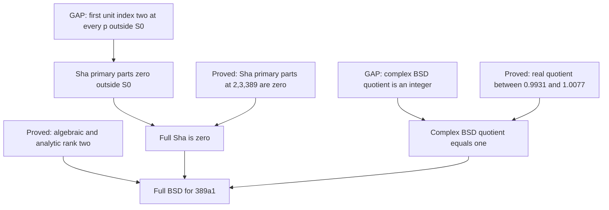

# Corrected proof architecture — BSD over the rationals

Updated: 2026-09-12 after the [continuation audit](continuation-2026-09-12.md).
This replaces the previous claim that P1, P2, and complex rationality alone
were already a sufficient package.

## 1. Exact bookkeeping

Write $r=\operatorname{rank}E(\mathbb Q)$, $a=\operatorname{ord}_{s=1}L(E,s)$,
$s_p=\operatorname{corank}_{\mathbb Z_p}\operatorname{Sel}_{p^\infty}(E/\mathbb Q)$,
and $t_p=\operatorname{corank}_{\mathbb Z_p}\operatorname{Sha}(E/\mathbb Q)[p^\infty]$.

**[THEOREM]** The Kummer sequence gives $s_p=r+t_p$.
The primary Sha group is cofinitely generated, so $t_p=0$ is equivalent to
its finiteness. Thus
$$
[s_p=a\text{ and }\operatorname{Sha}[p^\infty]\text{ finite}]
\iff[r=a\text{ and }\operatorname{Sha}[p^\infty]\text{ finite}].
$$
If $s_p=a$ and $a$ independent points are exhibited, then $r=a$ and
$\operatorname{Sha}[p^\infty]$ is finite. Rank equality alone does not establish either
primary finiteness or $s_p=a$.

**[THEOREM]** Primary decomposition gives
$$
\operatorname{Sha}\text{ finite}\iff
[\operatorname{Sha}[p^\infty]\text{ finite for every prime }p]
\ \land\ [\operatorname{Sha}[p]=0\text{ for all but finitely many primes }p].
$$
An assertion about ordinary primes alone does not establish the second clause.

## 2. Selmer witnesses

**[CONDITIONAL]** In the rank-two Heegner setup of corrected Proposition 2.2,
with analytic-rank-one twist and the stated structure theorem available,
$$\nu_\infty=1\iff s_p=2.$$
A Mordell–Weil lower bound or primary finiteness remains necessary to deduce
rank two. No equivalence with $\mathscr M_1=\mathscr M_\infty$ is asserted.

**[CONDITIONAL]** For non-CM $E$, $p\ge5$, residual surjectivity, and the
Manin-constant hypothesis, a nonzero Kurihara family gives
$$s_p=\operatorname{ord}(\widetilde{\boldsymbol\delta}).$$
This is Kim's Theorem 3.1; it does not impose ordinarity.
See the [source and application](continuation-2026-09-12.md#2-what-this-proves-arithmetically).
To use this route for $a$, one must connect the modular-symbol index to the
complex analytic rank, then supply the rank/primary-finiteness input above.
CM curves require a separate route compatible with their residual images.

**[NEW, independently reviewed deduction]** With $r_0$ independent points, a unit Kurihara
witness with exactly $r_0$ prime factors implies $r=r_0$ and $\operatorname{Sha}[p^\infty]=0$.
The [proof](continuation-2026-09-12.md#5-a-more-concrete-uniform-target)
is a direct deduction from Kim's corank and finite-part formulas.
For 389a1 at $5$, the concrete calculation has been checked directly against
those formulas; it supplies the witness $41\cdot61$.

## 3. Leading terms and uniformity

Assume $r=a$, and put
$$c_E=\frac{L^{(r)}(E,1)}{r!\,\Omega_E\operatorname{Reg}_{\rm NT}},\qquad
C_E=\prod_{q\mid N}c_q,\qquad t=\#E(\mathbb Q)_{\rm tors}.$$

These are separate proof obligations:

- **[GAP] Rationality:** $c_E\in\mathbb Q^\times$.
- **[GAP] Primary control:** prove finiteness and determine $\#\operatorname{Sha}[p^\infty]$
  for every relevant prime.
- **[GAP] Comparison:** identify the rational $c_E$ with those arithmetic orders.

**[CONDITIONAL]** If $\operatorname{Sha}$ is finite, $c_E$ is positive rational, and
$$v_p(c_E)=v_p(C_E\#\operatorname{Sha}/t^2)\quad\text{for every prime }p,$$
then full BSD(lead) follows. Indeed the positive rational quotient of the two
sides has zero valuation at every prime, hence is $1$. This is a sufficient
bookkeeping package, not a proof of its premises.

The ordinary-prime $\mathrm U(E)$ of Proposition 3.3 is another, stronger local
comparison assumption. Under that proposition's integral main-conjecture and
height hypotheses it implies almost-all-prime triviality *within its specified
ordinary set*. It neither identifies its rational constant with the complex
$c_E$ nor covers the complementary primes automatically. The reverse direction
also needs the $p$-adic BSD formulas and the required height nonvanishing.

## 4. Completed deductions and the current test-curve target

The [odd-rank bridge](odd-rank-selmer-bridge.md) proves $s_p\ge3$ in odd
analytic rank at least three under its stated ordinary and semistable
supersingular hypotheses. This settles the former GAP 5 in its ordinary
range. The next odd lower-bound statement is O5 in that note.

For 389a1, [analytic rank equality](analytic-rank-certificates.md),
[the full basis and real interval](bsd-archimedean-bound.md), and
[triviality at $2,3,389$](exceptional-prime-finiteness.md) are certified.
The [uniform-witness theorem](uniform-witness-attack.md) proves, at every
$p\notin S_0=\{2,3,389\}$,
$$u_p=2+\dim_{\mathbb F_p}\operatorname{Sha}(389a1)[p],\qquad u_p<\infty.$$
Thus the following two-node target is sufficient for full BSD for this curve:

The integrality node is an unproved arithmetic comparison, not a consequence
of the narrow interval or of rationality alone. An almost-all-prime witness
argument introducing additional exceptions must handle those primes separately.
The [one-sided comparison criterion](derived-comparison-attack.md#6-the-units-can-be-bypassed-a-one-sided-and-archimedean-reduction)
and [uniform torsor degree criterion](genus-one-finiteness-attack.md#3-the-uniform-degree-criterion-really-is-full-finiteness)
are alternative approaches with explicit hypotheses.

Completing these nodes would settle this curve, not the universal BSD objective.
Uniform higher-rank comparisons, CM coverage, and the corresponding leading-term
identifications for all curves remain separate obligations. No complete proof
or counterexample has been obtained.
